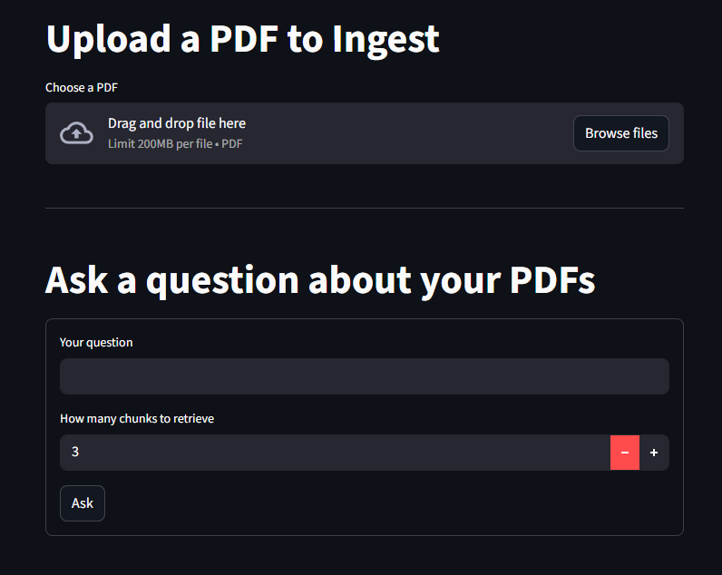
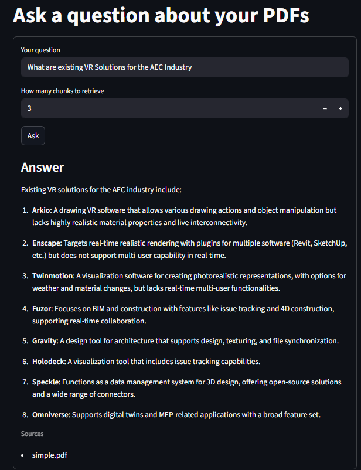

# 🧠 RAG AI Agent

RAG AI Agent ingests PDFs, indexes their content, and provides **AI-powered answers** to user queries using a combination of vector search and GPT-based language models.
Built with **Inngest**, **Qdrant**, **OpenAI embeddings/LLMs**, **FastAPI**, and a **Streamlit** UI.

---

## 🚀 Features

- 📄 Automated PDF ingestion — chunking, embedding, and indexing  
- 🔄 Event-driven workflows powered by Inngest  
- 🔍 Semantic search using Qdrant  
- 💬 Context-aware answers with GPT-4o-mini  
- 🎨 Clean Streamlit interface for upload & querying  
- 📊 Workflow observability via the Inngest Dev Server  

---

## 🧱 Architecture

```
Streamlit UI → FastAPI Server → Inngest Functions
                                      ↓
                    OpenAI Embeddings + Qdrant Vector DB
```
## 📁 Project Structure

- **streamlit_app.py** – Streamlit frontend    
- **vector_db.py** – Stores and retrieves vectors with metadata
- **data_loader.py** – Loads, chunks and embeds PDF Documents
- **custom_types.py** – Data models for RAG operations
- **.venv** - Stores private OPENAI API key
- **qdrant_storage/** - Qdrant-powered vector storage
- **screenshots/** – Demo and UI images
- **uploads/** - Uploaded PDFs

---

## 📦 Prerequisites

- Python **3.8+**  
- Qdrant server running at **localhost:6333**  
- OpenAI API key  
- Inngest Dev Server running at **localhost:8288**

---

## 🚀 How It Works

1. **PDF Upload** – Users upload PDFs through the Streamlit interface.  
2. **Automatic Chunking & Embedding** – Text is split into chunks and converted into embeddings using OpenAI.  
3. **Vector Storage** – Embeddings are stored in Qdrant for semantic retrieval.  
4. **Workflow Automation** – Inngest functions handle ingestion and indexing asynchronously.  
5. **Question Answering** – Users ask questions, and the system returns answers grounded in the documents.  

---

## 🖼️ Screenshots

### Upload PDF
<p align="center">
  
</p>

*Upload your PDF documents for extraction and indexing.*

---

### Ask Questions
<p align="center">
  
</p>

*Type any question related to your uploaded documents.*

---

### Get AI Answers
<p align="center">
  
</p>

*Receive grounded, citation-rich answers powered by RAG.*

---


